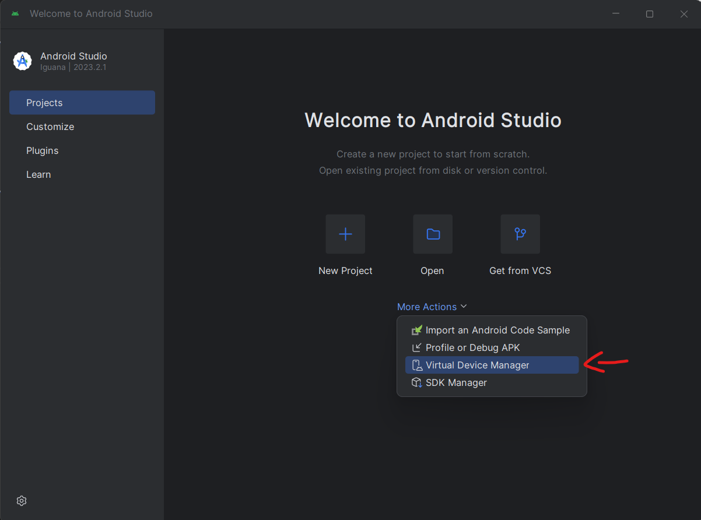
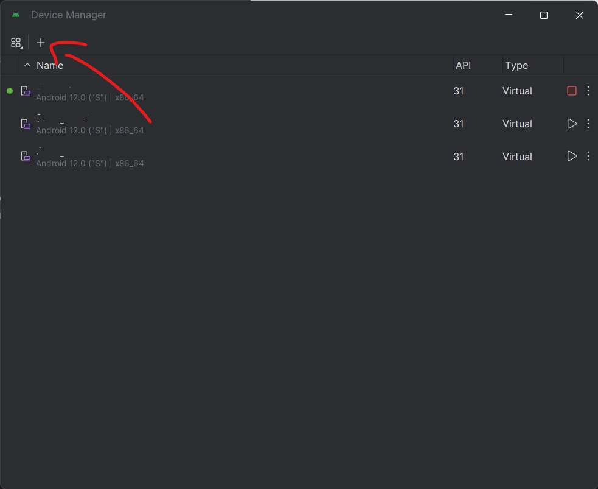
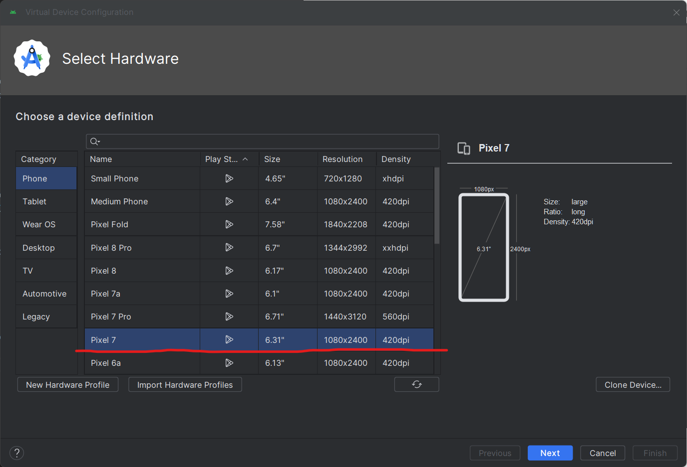
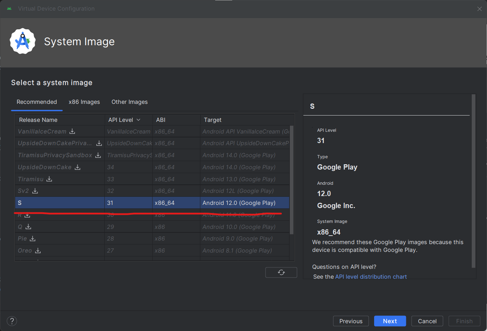
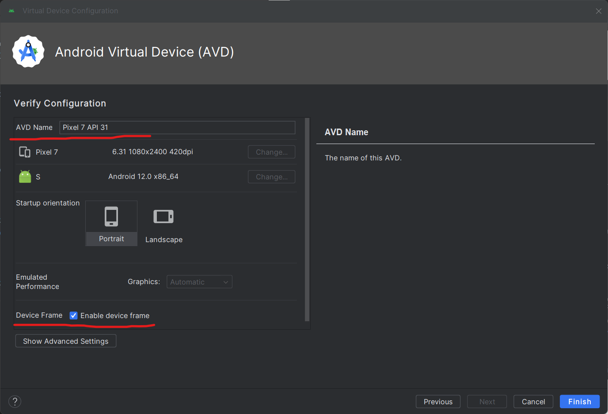
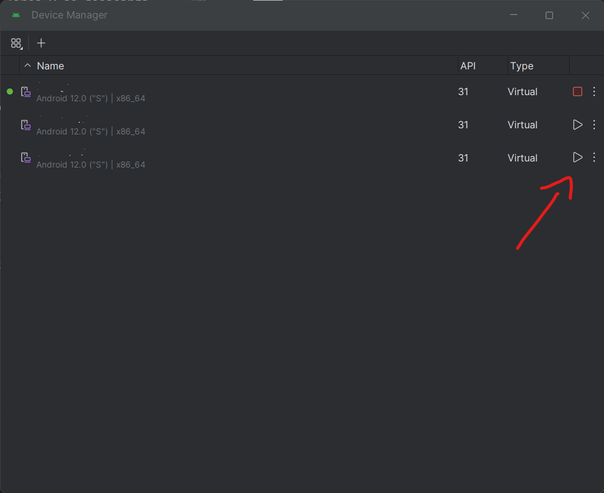
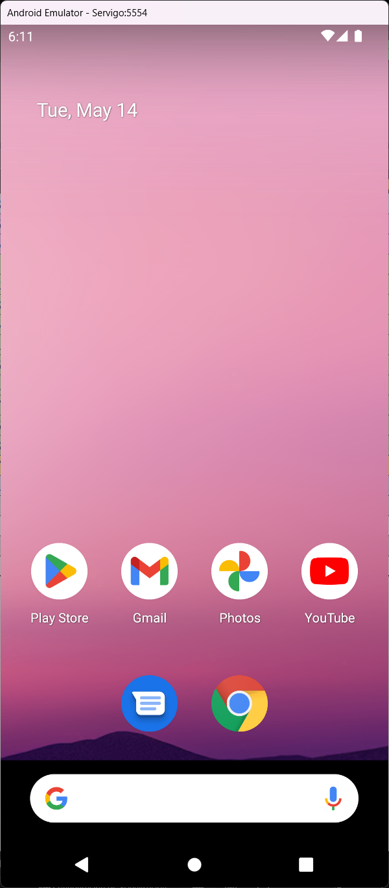
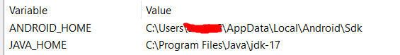
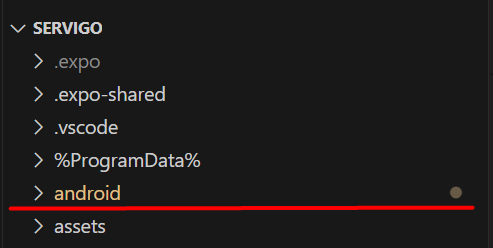

# Instalación de Location ToDo

Location ToDo es una aplicación que te permite agregar tareas pendientes por hacer, asignando una ubicación en el mapa de dónde se deben llevar acabo las tareas, de esta forma la aplicación notificará al usuario al momento de acercarse a la zona de dicha tarea.

Aunque es posible ejecutar la aplicación en un emulador de Android para desarrollo, se recomienda usar dispositivos físicos para un correcto comportamiento con el manejo de coordenadas en la ubicación del usuario.

### Índice
* [Emulador de Android Studio](#emulador-de-android-studio)
* [JAVA y Variables de Entorno](#java-y-variables-de-entorno)
* [Expo y EAS (servidor local y generador de paquetes)](#expo-y-eas-servidor-local-y-generador-de-paquetes)
* [Ejecutando la app por primera vez](#ejecutando-la-app-por-primera-vez)
* [Trabajando en la app](#trabajando-en-la-app)
* [Generación de Bundle y APK](#generación-de-bundle-y-apk)

---

### Emulador de Android Studio
El método más práctico para desarrollar en tiempo real es tener un emulador de Android corriendo en tiempo real, para esto se instala el software oficial de Google, Android Studio

La instalación es básica, se realiza la búsqueda en linea y se desacarga desde la página oficial

Una vez instalado, nos dirigimos a **Virtual Device Manager**. 

En **Virtual Device Manager** seleccionamos el signo de + para crear un nuevo emulador. 

Al día de hoy (23/06/2024) se utiliza el **Pixel 7** de 6.31 pulgadas. 
***Importante: Debe incluir la funcionalidad de Play Store para el sistema de tracking.*** 

Al día de hoy (23/06/2024) se utiliza el OS **Android 12.0 API 31**. 
*El OS mínimo recomendado es Android 10.0 API 29* 

En este punto se puede asignar cualquier nombre que se desee para identificar el emulador. 
Como sugerencia, se recomienda desmarcar la casilla de ***Enable device frame*** 

Una vez guardado el emulador, sólo es necesario iniciarlo desde el **Device Manager** 

Ya iniciado el emulador no es necesaria más configuración en este punto. 

  
### JAVA y Variables de Entorno *(Windows Version)*

Para la ejecución del proyecto es necesario instalar JAVA en su versión jdk-17.
La instalación es un proceso común, descargar desde cualquier fuente e instalar con proceso común.

Una vez instalado, es necesario crear la ruta como variable de entorno hacia la ruta de instalación bajo el nombre ***JAVA_HOME***, comúnmente es `C:\Program Files\Java\jdk-17`, pero puede variar según la ruta de instalación seleccionada por el usuario.

También es necesario agregar la variable de entorno para el emulador de Android bajo el nombre de ***ANDROID_HOME***. La ruta común es `C:\Users\[nombre de usuario]\AppData\Local\Android\Sdk`. 
***Nota: Para acceder esta ruta desde el explorador de windows, es necesario tener habilitada la opción de*** *"Elementos ocultos"*.

### Expo y EAS (servidor local y generador de paquetes)
***Expo*** es un framework que permite crear proyectos de React Native de forma más sencilla, además de incluir el servidor local Metro para desarrollo en tiempo real.

***EAS*** es una hrramienta de Expo que nos permite generar Bundles para Play Store y APKs para instalación directa en dispositivos.

Para las instalaciones de ambos, es necesario contar con la versión de node **18.16.0** y su respectivo npm, recomendable usar ***[Node Version Manager (NVM)](https://github.com/coreybutler/nvm-windows)***.

- Instalación de Expo: `npm install -g expo-cli` 
- Instalación de EAS: `npm install -g eas-cli`

Una vez instalados, no requieren configuración extra.

### Ejecutando la app por primera vez
Una vez instalado y configurado todo lo anterior, es necesario instalar las librerías del proyecto, sólo es necesario ejecutar el comando `npm install`.

Ya instalada necesitamos construir las configuraciones para Android, y asegurarnos de que el sistema de tracking funcione correctamente. 
Para realizar esto, ejecutamos el comando `npx expo prebuild -p android`. 
En caso de recibir un error, eliminaremos la carpeta `android` del proyecto y ejecutamos nuevamente el comando anterior.

Si todo fluye con normalidad, esta carpeta debería regenerarse sin inconvenientes.

Para iniciar la aplicación ahora debemos pre-compilarla, esto generará un *DevClient* que será instalado en el emulador, y nos permitirá desarrollar en tiempo real para visualizar los cambios efectuados.

***Nota Importante: Antes de correr el comando, asegurate de tener el emulador abierto y listo para usar***

Ya con el emulador corriendo, simplemente ejecutamos el comando `npx expo run:android` 
Este comando compilará el proyecto y de forma automática instalará el DevCliente en nuestro emulador, además de iniciar la app por primera vez.

Este proceso puede tomar de 5 a 15 min en ejecutarse. 
Si no recibimos ningún error, la aplicación estará lista para usarse.

### Trabajando en la app
***!! Es necesario [ejecutar la app por primera vez](#ejecutando-la-app-por-primera-vez) antes de continaur en este punto.***

Después de ejecutar la aplicación por primera vez, usaremos comandos distintos para iniciar el servidor de Metro (de Expo) e iniciar la aplicación en el emulador.

Para inciar el servidor, ejecutamos en la consola del proyecto el siguiente comando `npx expo start --dev-client -c`, esto iniciará Metro para ejecutarse con el DevClient limpiando la caché.

Con el emulador ya abierto, sólo es necesario usar los atajos en la consola para ejecutar la app.

`a`: Inicia la aplicación en el emulador ya abierto (requiere [ejecutar la app la primera vez](#ejecutando-la-app-por-primera-vez)) 
`r`: Recarga la app aplicando los cambios guardados en cualquier parte del proyecto 
`A`: Muestra un listado de los emuladores disponibles para iniciar la app

Con la app ya iniciada es posible trabajar en el código y ver los cambios reflejados en el emulador al guardar los cambios, pero es recomenadable aplicar una recarga en la consola *(comando* `r`*)*  para asegurar que sean correctamente aplicados.

### Generación de Bundle y APK

Los archivos ***APK*** nos permiten instalar la aplicación directamente en los dispositivos Android, mientras que los archivos ***Bundle*** son necesarios para publicar un nuevo release en Play Store.

***Notas Importantes:*** 
- ***Cualquier cambio realizado en el proyecto necesita ser commiteado en git antes de generar el APK o Bundle***

La propiedad `"version"` es el número de versión visible hacia el usuario conformado de 3 dígitos. 
La propiedad `"code"` es la versión del código que se utiliza para identificarse como única para publicar el bundle en Play Store, este valor es único y no permite repetirse en Play Console.

La generación de APKs o Bundles se realiza a través de Expo, la configuración necesaria ya se encuentra realizada en el archivo [eas.json](eas.json), actualmente el proyecto se encuentra vínculado a la cuenta personal del desarrollador Orlando Sotelo.

Para generar un APK sólo es necesario ejecutar el comando `eas build -p android --profile preview` 
Para generar un Bundle sólo es necesario ejecutar el comando `eas build -p android --profile console`

Ambos comandos iniciarán el proceso para la generación, en consola obtendremos un enlace a la página de Expo donde podemos monitorear la generación del proyecto. 
*Nota: Con una cuenta gratuita de expo, existe la probabilidad de esperar turno en fila en horarios concurridos*

Ya con el paquete generado, es posible descargarlo desde la página y podremos hacer uso de él.
